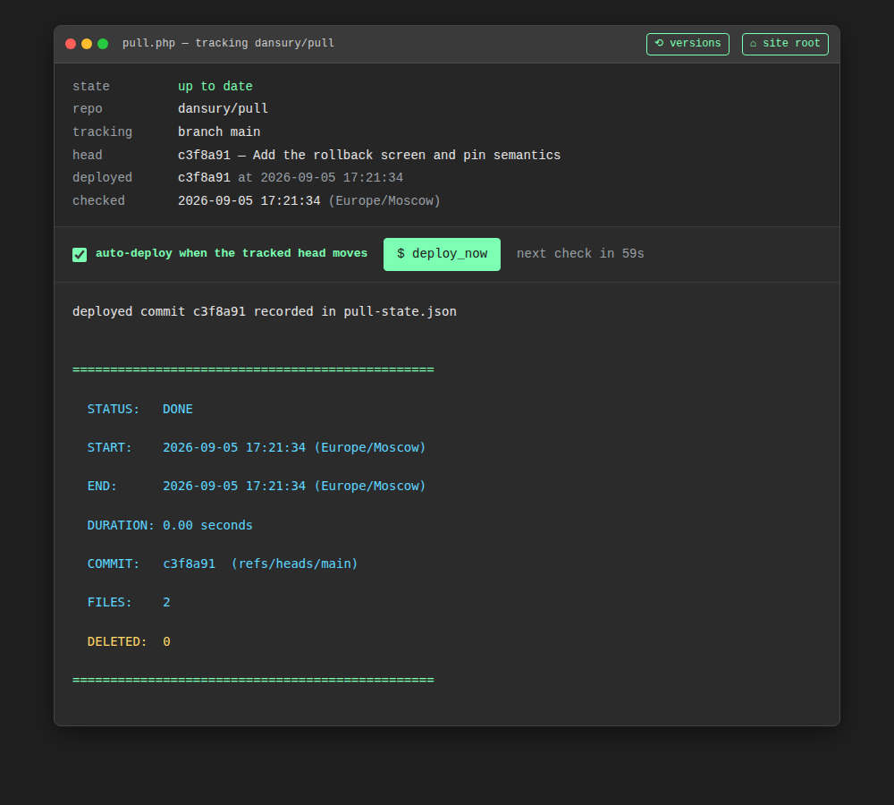
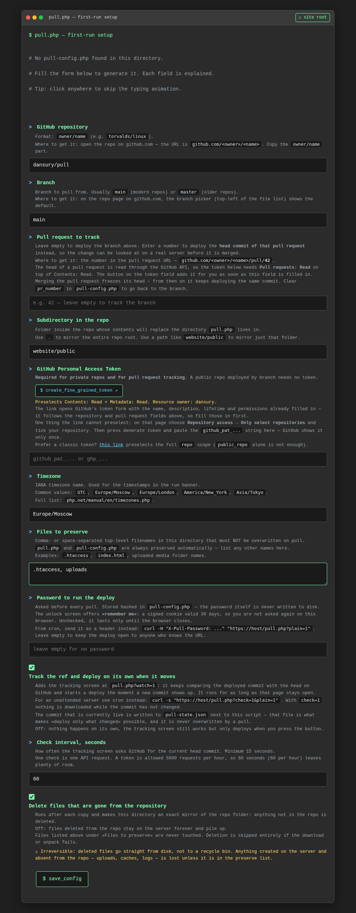
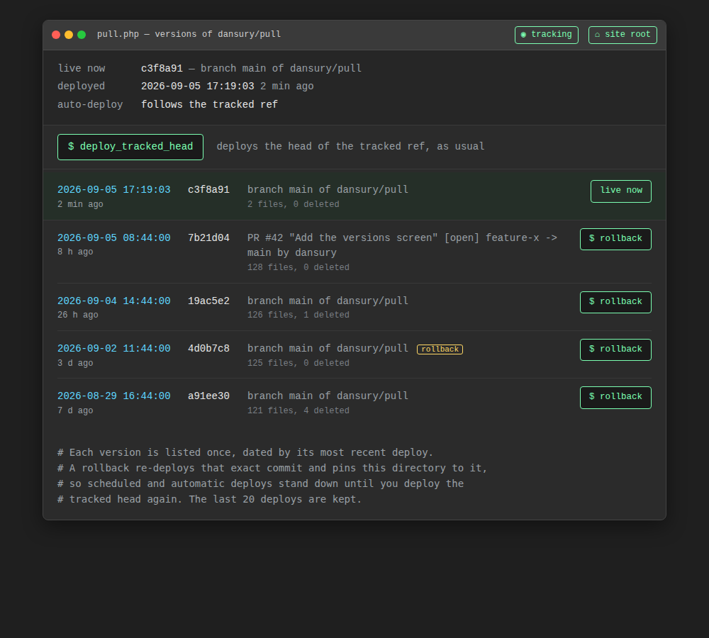
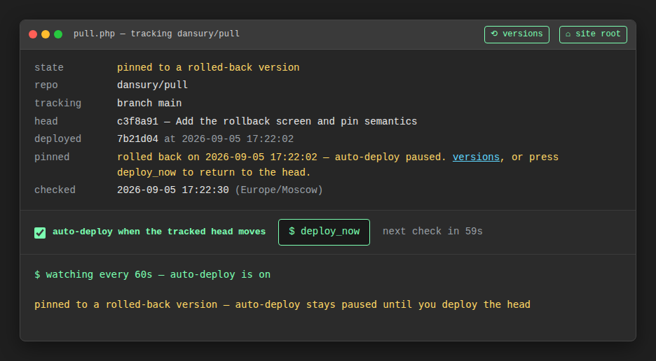
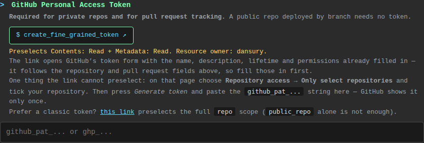

# pull.php

**Auto-deploy from GitHub to shared hosting — in a single PHP file.**

[Русская версия](README.md)

`pull.php` downloads a ZIP archive of the chosen branch, unpacks it and copies
the contents of the folder you pick into the directory the script itself lives
in. No git, no SSH, no shell access on the server — just PHP and plain outbound
HTTPS.

It can track a **pull request** as well as a branch: the PR's head commit gets
deployed, so a change can be looked at on a real server before it is merged. The
script remembers which commit is live, which is what lets it **pull on its own**:
the tracking screen at `pull.php?watch=1` deploys a new commit as soon as it
appears, and `pull.php?check=1` in cron downloads nothing while the commit has
not moved. Deployed versions are kept in a log, so **any of them can be rolled back to in
one click** — with the date it was live on the server.

All of it is configured by the first-run form — which also has a button that
opens GitHub with the right fine-grained token permissions already selected.



---

## Why this exists

### The problem

The code lives on GitHub, the site lives on cheap shared hosting where the only
tools are FTP and a control panel. Moving files between the two by hand breaks
in predictable ways:

- some files don't get uploaded — production runs half a feature;
- an older version gets uploaded over a newer one — and there's nothing to roll
  back to;
- nobody knows what is actually on the server: production matches no commit;
- files deleted from the repo stay on the server for years — dead scripts,
  forgotten backups, junk that is sometimes still reachable by direct URL;
- only the person with a configured FTP client can update the site.

Proper CI/CD solves this, but wiring up GitHub Actions with FTP deploy, storing
secrets and debugging a pipeline costs more than a landing page is worth. And
`git pull` over SSH isn't an option: this kind of hosting has neither SSH nor
git.

### The solution

One file, dropped into the site directory, that deploys when you open a link.
The server's state becomes a copy of the GitHub branch — with mirror mode on,
an exact copy, with no accumulated leftovers.

### Who it's for

- **Freelancers and web studios** shipping sites to a client's shared hosting
  without SSH.
- **Small teams** running landing pages, brochure sites, static content and
  simple PHP sites, where full CI is overkill.
- **A site owner or content manager** — updating the site becomes "open a link,
  press a button", with no git and no FTP client.
- **Agencies handing a project over**: the client keeps the hosting, the source
  stays on GitHub, this file connects them.

### What you get

| | Before | After |
|---|---|---|
| Deploy | FTP client, by hand, file by file | open a URL or one cron line |
| Source of truth | "something is on the server" | a branch on GitHub |
| Leftovers from old versions | pile up for years | removed automatically (mirror mode) |
| Who can deploy | whoever has FTP configured | whoever has the `pull.php` password |
| Infrastructure | — | none: no runner, no composer, no dependencies |
| Setup | — | a browser form on first open |
| What is on the server | "some version" | the commit recorded in `pull-state.json` |
| Reviewing a PR | download the branch, upload by hand | `pull.php?watch=1` tracks and deploys it |
| Rolling back | dig out a backup, upload over FTP | a button next to the version and its deploy date |

### When not to use it

Honest limits:

- **You need a build step** (`npm run build`, asset compilation) — the script
  deploys the repo as is. Options: commit the built output, or build in CI and
  push the artifacts to a separate branch and point `pull.php` at that branch.
- **A large repo or frequent deploys** — every run downloads the whole branch
  archive; there is no incremental transfer.
- **You need atomic deploys, rollback, DB migrations, zero downtime** — during
  the copy the site is briefly in an in-between state. Use Deployer,
  Capistrano or real CI for that.
- **The host has SSH and git** — then `git pull` is simpler, faster and more
  honest.

---

## How it works

1. Asks the GitHub API for the current head of the tracked ref — a branch or a
   pull request. The answer is printed before anything is downloaded.
2. Downloads the archive of that exact commit
   (`api.github.com/repos/…/zipball/<sha>`, with `codeload.github.com` as a
   fallback). If the head could not be read, it falls back to the branch archive
   the way it always did.
3. Unpacks it into a temp directory (`sys_get_temp_dir()`).
4. Locates the configured subdirectory (`subdir`) inside the archive.
5. Copies its contents over the script's directory, skipping the preserve list.
6. If mirror mode is on, deletes everything in the directory that is no longer
   in the repository.
7. Writes the deployed commit to `pull-state.json` — that is how you can tell
   what is live, how "deploy only what changed" works, and where the versions
   offered for rollback come from.
8. Cleans up temp files and prints a summary banner: status, start and end time,
   duration, the commit, files copied and files deleted.

## Requirements

- PHP 7.4+
- the `ZipArchive` extension
- cURL, or `allow_url_fopen = On`
- outbound HTTPS to `github.com` / `api.github.com` / `codeload.github.com`
- write access to the deploy directory
- a token with `Contents: Read` — for a private repo, and for change tracking
  (without the API the script cannot tell whether the commit moved)

## Installation

1. Upload `pull.php` into the site directory you want to keep updated (the
   web root or `public_html/`, for example).
2. Open `https://your-site/pull.php` in a browser.
3. On the first run (no `pull-config.php` next to it yet) a setup form appears —
   fill it in and press "save_config".
4. The script writes `pull-config.php` (mode `0600`) and offers to run the first
   deploy right away, or to open the tracking screen.

<details>
<summary>What the setup form looks like</summary>



</details>

From then on, every visit to `pull.php` performs a deploy, and `pull.php?watch=1`
shows what is live and deploys new commits on its own.

## Setup fields

| Field | Meaning | Example |
|---|---|---|
| `repo` | repository as `owner/name` | `dansury/pull` |
| `branch` | branch to pull from | `main` |
| `subdir` | folder inside the repo whose contents replace the script's directory; `.` mirrors the repo root | `.` or `website/public` |
| `gh_token` | Personal Access Token, **only needed for private repos** | `github_pat_…` |
| `timezone` | IANA timezone for the timestamps in the banner | `Europe/Moscow` |
| `keep_files` | top-level file and folder names that must never be overwritten or deleted | `.htaccess, uploads` |
| `pr_number` | number of the pull request to track; empty means track the branch | `42` |
| `password` | password required to run a deploy; empty means no password | `••••••` |
| `auto_pull` | track the commit and deploy a new one automatically | on by default |
| `auto_interval` | how often the tracking screen asks GitHub, seconds (minimum 15) | `60` |
| `purge` | delete files that are no longer in the repository | on by default |

`pull.php`, `pull-config.php` and `pull-state.json` are always preserved,
regardless of `keep_files`.

The token field carries a **`$ create_fine_grained_token ↗`** button that opens
GitHub's form with the permissions already selected — see
[Access token](#access-token).

## Password and "remember me"

The script's URL triggers a deploy, so setting a password is worth doing right
away.

- The password is **stored hashed** (`password_hash()`); the password itself
  never touches the disk. Minimum length is 6 characters.
- Every run is gated by an unlock screen with a **"remember me on this browser"**
  checkbox:
  - checked — a signed cookie is stored for **30 days** and you are not asked
    again;
  - unchecked — the cookie is a session cookie and dies with the browser (what
    you want on a shared computer).
- The cookie holds no password: it is an expiry plus an HMAC signature keyed by
  the stored hash. It cannot be forged without access to `pull-config.php`, and
  changing the password invalidates every cookie issued earlier.
- The cookie is set with `HttpOnly`, `SameSite=Lax`, `Secure` (over HTTPS), and
  is scoped to the script's directory.
- `pull.php?logout=1` forgets the password on this browser.

Leaving the password empty is allowed — the deploy is then open to anyone who
knows the URL; see [Security](#security).

## What to track: a branch or a pull request

The `pr_number` field decides where a deploy comes from.

- **Empty — the branch is tracked** (`branch`). The usual mode: the server always
  holds the head of that branch.
- **A number — that pull request is tracked.** Its head commit is deployed, so
  the change can be reviewed on a live server before it is merged. The number
  comes from the PR URL: `github.com/<owner>/<name>/pull/**42**`.

Tracking a PR needs a token with **Pull requests: Read** on top of
**Contents: Read** — turning a PR number into a commit goes through the API. If
the pull request cannot be read the script **stops without touching anything**:
quietly deploying the branch instead would ship the wrong code.

Once the PR is merged its head stops moving and the deploy keeps shipping the
same commit forever. To go back to the branch, clear `pr_number` in
`pull-config.php` (`'pr_number' => 0, 'source' => 'branch'`).

## Automatic pulling

The deployed commit is written to `pull-state.json` next to the script.
Comparing it with the head on GitHub is how the script knows there is anything
to deploy.

### Tracking screen — `pull.php?watch=1`

A live panel: the repository, what is tracked (branch, or PR with its title,
author and branches), the head on GitHub, the deployed commit with its
timestamp, and the state (`up to date` / `new commit ahead` / `never deployed`).

- The **"auto-deploy when the tracked head moves"** checkbox: as soon as a new
  commit shows up the deploy starts by itself, and its output is streamed line
  by line onto that same page.
- The **`$ deploy_now`** button deploys immediately, without waiting for the
  next check.
- Polling happens every `auto_interval` seconds (60 by default — 60 API calls an
  hour against a limit of 5000).

Tracking runs for as long as the page stays open. The checkbox only affects the
current tab; its initial value comes from `auto_pull`.

### Cron — `pull.php?check=1`

For a server with nobody watching a browser:

```cron
*/5 * * * * curl -s -H "X-Pull-Password: password" "https://your-site/pull.php?check=1&plain=1" >> /var/log/pull.log 2>&1
```

With `check=1` the script asks for the head first and, when the commit has not
changed, downloads nothing and writes nothing — the log just shows
`STATUS: UP-TO-DATE`. That makes frequent polling cheap.

### JSON — `pull.php?status=1`

The same snapshot in machine-readable form: `sha`, `deployed`, `changed`, the PR
details, and the time of the last deploy. The password, when set, is required
here too (as the `X-Pull-Password` header); without it you get a `401` and
`{"ok":false,"auth":false}`.

## Rolling back to an earlier version

Every deploy is appended to a log inside `pull-state.json`: the commit, where it
came from (a branch or a PR), the date, and how many files were copied. The
`pull.php?history=1` screen shows that log as a list of versions — each version
once, dated by its most recent deploy.



The `$ rollback` button next to a version deploys **that exact commit** again,
after a confirmation in the browser. Only versions that actually stood on this
server can be reached: the list comes from the log, so an arbitrary commit cannot
be slipped in. The last 20 deploys are kept.

### The pin: why auto-deploy does not undo a rollback

After a rollback the directory is pinned to the old version. Otherwise the next
check would notice the head sitting ahead and immediately undo the rollback.
While the pin holds:

- `pull.php?check=1` deploys nothing and reports `STATUS: PINNED`;
- the tracking screen shows `pinned to a rolled-back version` and does not start
  a deploy on its own (the `$ deploy_now` button still works).



The pin lifts on any ordinary deploy of the current version: the
`$ deploy_tracked_head` button on the versions screen, `$ deploy_now` on the
tracking screen, or simply opening `pull.php`. The output then carries an
`unpinned: …` line and automation resumes.

### What a rollback does and does not do

- A rollback is a deploy of old code over the directory, under the same
  `keep_files` and mirror-mode rules. It does not roll back databases or files
  uploaded by users.
- GitHub must still serve the archive for that commit. For branches it almost
  always does; a PR head can disappear after a force-push, in which case the
  rollback fails on download and the directory is left untouched.
- It can be triggered outside the browser too, as a POST with a `rollback` field:

  ```bash
  curl -s -X POST -H "X-Pull-Password: secret" \
       -d "rollback=<full sha>" "https://your-site/pull.php?plain=1"
  ```

## Deleting obsolete files (mirror mode)

The `purge` option — the "Delete files that are gone from the repository"
checkbox — is **on by default** for new installs.

What it does: after every copy it walks the directory and deletes everything
that is not in the repository, making the directory an exact copy of the repo
folder.

> ⚠️ **This is irreversible.** Files are removed from disk; there is no recycle
> bin. Anything created on the server and absent from the repository — user
> uploads, caches, logs, config files — is deleted unless it is listed in
> `keep_files`.

What keeps it safe:

- names in `keep_files` (plus `pull.php` and `pull-config.php` always) are
  skipped entirely, including everything inside them if they are folders;
- deletion runs **only after a successful copy** — a failed download or a broken
  archive never deletes anything;
- symlinks are not followed: the link itself is removed, whatever it points at
  is left alone.

With the option off, files removed from the repository stay on the server and
have to be cleaned up by hand.

**For existing installs:** an older `pull-config.php` has no `purge` key, and in
that case mirror mode is treated as **off** — updating the script alone will
never delete anything. To enable it, add `'purge' => true` to the config, or
delete `pull-config.php` and run the setup again.

## Access token

There is exactly one case where no token is needed: a public repo, tracked by
branch, with change tracking unused. Everything else needs one.

### The button that generates a key with the right permissions

The token field in the setup form carries a **`$ create_fine_grained_token ↗`**
button. It opens GitHub's token form with the name, description, lifetime and
permissions already filled in — GitHub accepts all of them straight from the
link. The link keeps up with the form as you type: the resource owner comes from
the `repo` field, and **Pull requests: Read** is added the moment `pr_number` is
filled in.

```
https://github.com/settings/personal-access-tokens/new
  ?name=pull.php deploy owner/name
  &description=…
  &expires_in=none
  &contents=read
  &metadata=read
  &pull_requests=read      ← only when tracking a PR
  &target_name=owner
```



One thing the link cannot preselect: the repositories themselves. On the page
that opens, pick **Repository access → Only select repositories**, tick your
repo, press "Generate token" and paste the `github_pat_…` string into the form.
GitHub shows it only once.

### Doing it by hand

**Fine-grained PAT** — `github.com/settings/personal-access-tokens/new`:
Repository access → "Only select repositories" → this repo;
Repository permissions → **Contents: Read**, plus **Pull requests: Read** when
tracking a pull request.

**Classic PAT** — `github.com/settings/tokens/new`: the full `repo` scope
(`public_repo` alone is not enough for a private repository).

A `401`/`404` while a token is set means the token has no access to that
specific repo, or it expired or was revoked. The script prints this hint itself,
with a ready-made link for creating the right token.

## Config file

`pull-config.php` is generated by the form and simply returns an array, so you
can edit it by hand:

```php
<?php
return [
    'repo'          => 'owner/name',
    'branch'        => 'main',
    'subdir'        => '.',
    'gh_token'      => '',
    'keep_files'    => ['pull.php', 'pull-config.php', '.htaccess', 'uploads'],
    'timezone'      => 'Europe/Moscow',
    'password_hash' => '',       // password hash; empty means no password
    'purge'         => true,     // delete files that are not in the repository
    'source'        => 'branch', // 'branch' or 'pr'
    'pr_number'     => 0,        // PR number when 'source' => 'pr'
    'auto_pull'     => true,     // the tracking screen deploys new commits itself
    'auto_interval' => 60,       // GitHub poll interval, seconds (minimum 15)
];
```

A config written by an older version keeps working unchanged: without the
`source` key it stays a plain branch deploy with auto-pulling off.

Never put a plaintext password in this file — only a hash. Easiest is to set it
through the setup form, or generate one yourself:
`php -r "echo password_hash('your-password', PASSWORD_DEFAULT);"`.

Delete `pull-config.php` to bring the setup form back.

## Environment variables

Both are optional and set on the hosting side (via `.htaccess` `SetEnv` or the
control panel, for example).

| Variable | Purpose |
|---|---|
| `GITHUB_TOKEN` | access token; **takes precedence** over `gh_token` from the config — handy for keeping the secret out of the file |
| `KRASKI_PULL_ALLOW_IPS` | comma-separated list of IPs allowed to trigger a pull. Empty means no restriction; everyone else gets a `403` |

## Running it

| URL | What it does |
|---|---|
| `pull.php` | deploys the head of the tracked ref right now |
| `pull.php?watch=1` | tracking screen; deploys by itself while the box is ticked |
| `pull.php?check=1` | deploys only if the commit moved (for cron) |
| `pull.php?status=1` | JSON: what is on GitHub, what is live, is there a difference |
| `pull.php?history=1` | deployed versions with dates and a rollback button |
| `pull.php?plain=1` | the same output without markup, `text/plain` |
| `pull.php?logout=1` | forget the remembered password in this browser |

From a browser:

```
https://your-site/pull.php
```

The output is styled as a terminal and streams as the run progresses. The title
bar carries **◉ tracking** and **⟲ versions** links to the tracking screen and to
the list of deployed versions.

From cron or curl — `?plain=1` returns clean `text/plain` with no markup, and
the password goes in the `X-Pull-Password` header:

```bash
curl -s -H "X-Pull-Password: $PULL_PASSWORD" "https://your-site/pull.php?plain=1"
```

A daily deploy at 04:00 via cron:

```cron
0 4 * * * curl -s -H "X-Pull-Password: secret" "https://your-site/pull.php?plain=1" >> /var/log/pull.log 2>&1
```

For anything more frequent use `check=1` — it downloads no archive while the
commit has not changed:

```cron
*/5 * * * * curl -s -H "X-Pull-Password: secret" "https://your-site/pull.php?check=1&plain=1" >> /var/log/pull.log 2>&1
```

The password is also accepted as `?password=…`, but that lands in web server
logs and browser history — the header is safer.

Response codes: `200` success (including "already up to date" and "pinned" with `check=1`),
`401` password required or wrong, `403` IP not allowed, `502` archive download
failed or the pull request could not be read, `500` unpack error, missing
`ZipArchive`, subdirectory not found, or temp directory not writable.

Output is streamed, so failures found once copying is under way land in the text
rather than in the status code — in scripts, read the `STATUS:` line at the end
(`DONE`, `UP-TO-DATE`, `PINNED`, `FAILED`).

## Things to know

- **Mirror mode deletes permanently.** Anything that must survive on the server
  belongs either in the repository or in `keep_files`.
- **`keep_files` only applies at the top level.** Nested paths
  (`assets/config.json`) are not protected — inside subfolders everything is
  both copied and deleted.
- **The deploy is not atomic.** While files are being copied the site is briefly
  in an in-between state.
- **Hosting limits.** The script asks for `set_time_limit(300)` and sets
  `ignore_user_abort(true)`, but hard hosting limits can still cut a large
  repository off mid-run.
- **The token sits in a file next to the site.** The file is created with mode
  `0600`, but passing the token via `GITHUB_TOKEN` is safer.
- **Tracking only runs while the tab is open.** `?watch=1` is a browser page, not
  a daemon. A server that must update itself needs cron with `?check=1`.
- **`pull-state.json` holds the deploy log** — commits, dates, PR numbers and
  titles. It is created with mode `0600` so it is not served over HTTP. Deleting
  it breaks nothing, but the rollback history goes with it.
- **A rollback does not touch data.** Only code from the repository comes back;
  anything living outside it (databases, uploads, caches) stays as it is.

## Security

`pull.php` is reachable by anyone who knows the URL. Do at least one of:

- **set a password** during setup — the simplest option;
- set `KRASKI_PULL_ALLOW_IPS` to a list of trusted addresses;
- put the file behind HTTP auth (`.htaccess` + `.htpasswd`);
- rename the file to something unguessable (then add the new name to
  `keep_files` so a deploy doesn't wipe the script itself).

The password and the IP filter combine well: the filter rejects stray requests
before the password is even checked.
